- Deskripsi aplikasi web
- Penjelasan mengenai pembagian tugas masing-masing anggota (lihat formatnya pada bagian pembagian tugas).

## Cara Instalasi

1. **Clone repo melalui**

2. **Jalankan build docker**
    ```
    docker-compose build
    ```

3. **Tunggu selesai...**

## Cara Menjalankan

1. **Jalankan compose up**
    ```
    docker-compose up
    ```

2. **Akses front-end melalui**
    ```
    http://localhost:5173/
    ```

## API Documentation

- **Dapat diakses melalui**
    ```
    http://localhost:3000/api-docs/
    ```
## Features
- **Landing Page**

<div align="center">
  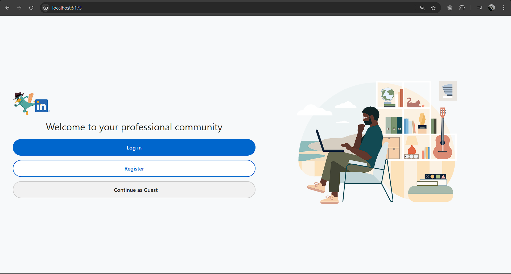
</div>

- **Feed (Logged-In)**

<div align="center">
  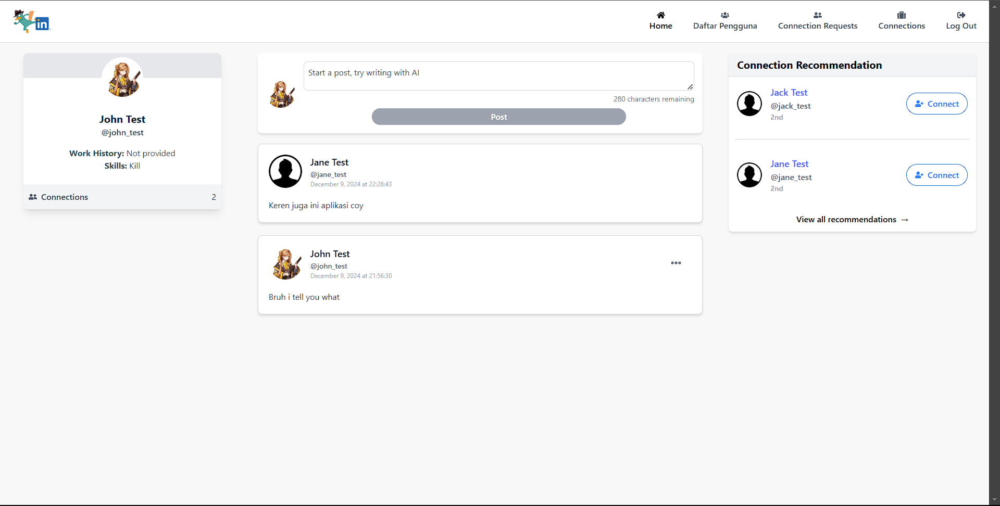
</div>

- **Users (Logged-In | Guest)**

<div align="center">
  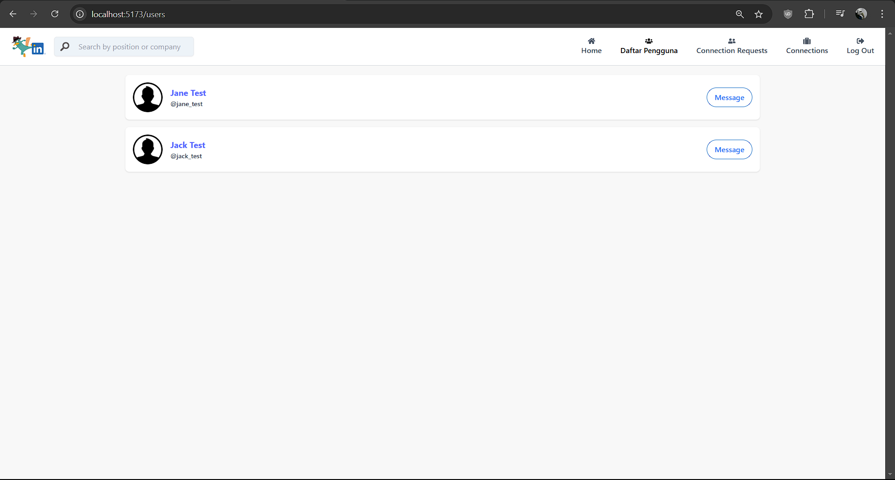
</div>

<div align="center">
  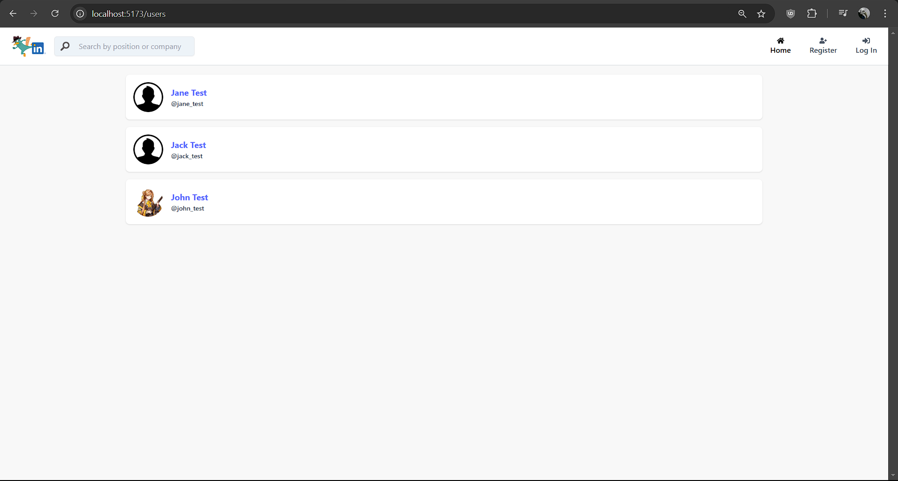
</div>

- **Profile (Logged-In Self | Logged-In other | Guest)**

<div align="center">
  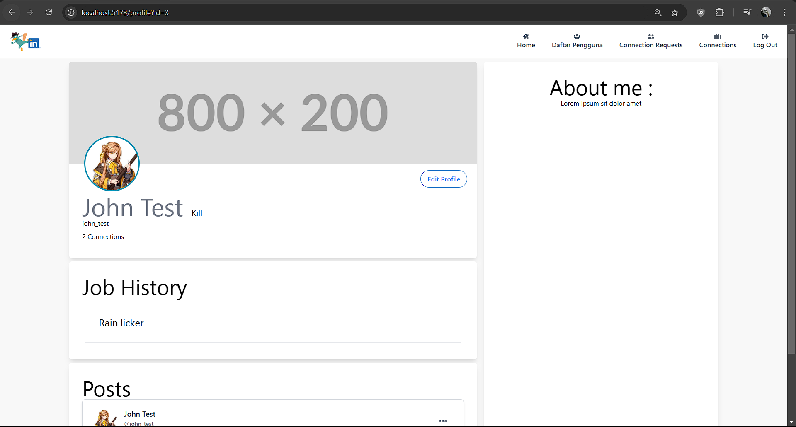
</div>
<div align="center">
  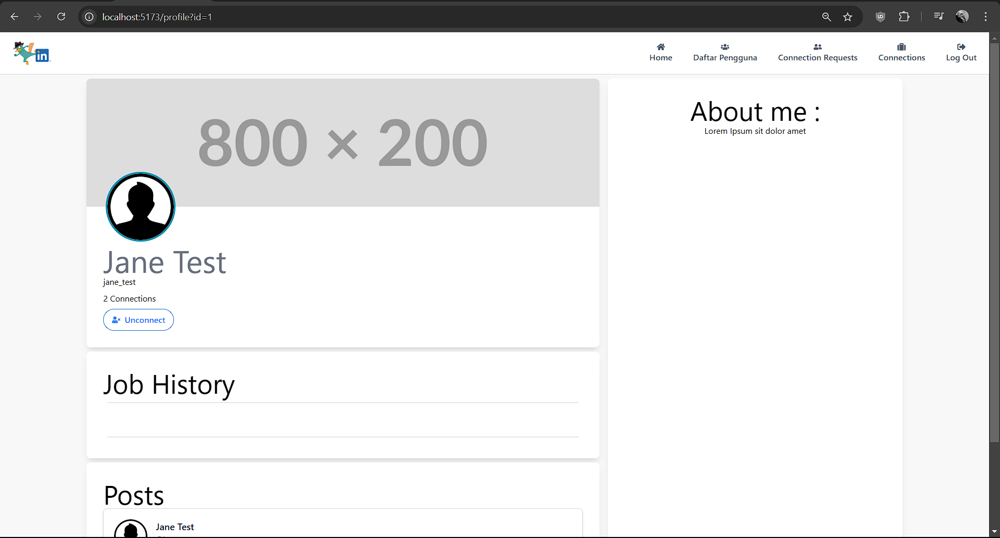
</div>
<div align="center">
  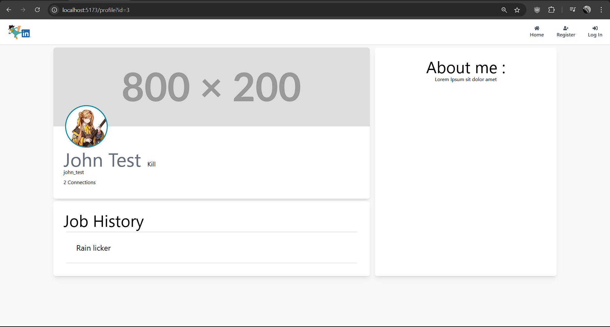
</div>


- **Connection Requests (Logged-In)**

<div align="center">
  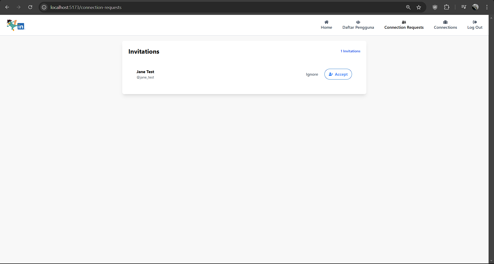
</div>

- **Connections (Logged-In)**

<div align="center">
  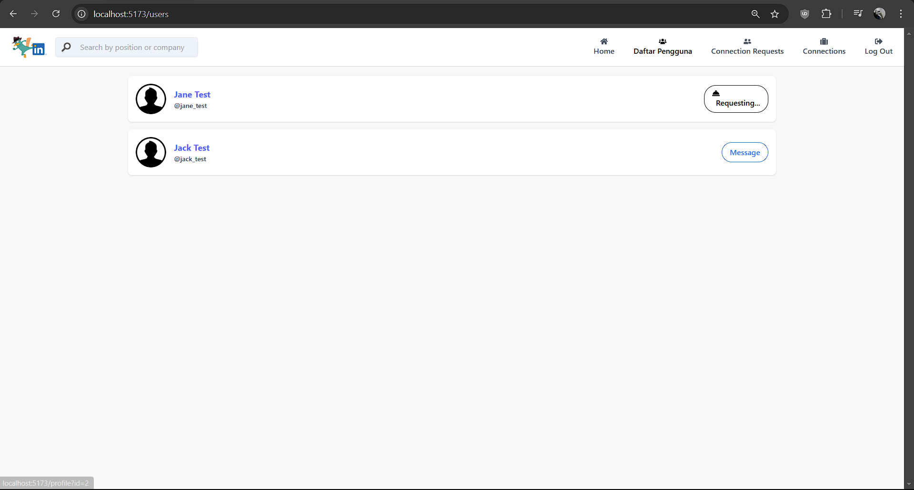
</div>

- **Chat (Logged-In)**

<div align="center">
  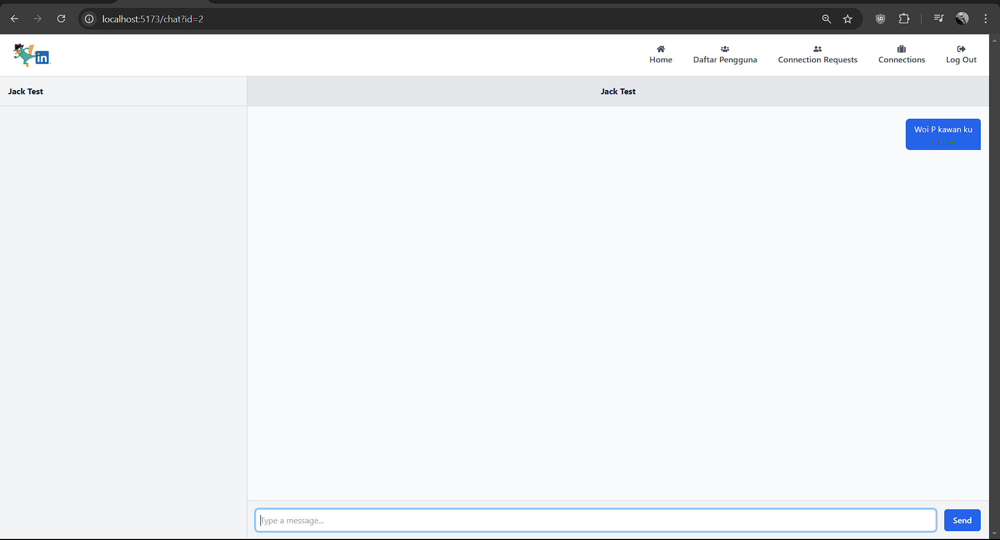
</div>

## Load Test

<div align="center">
  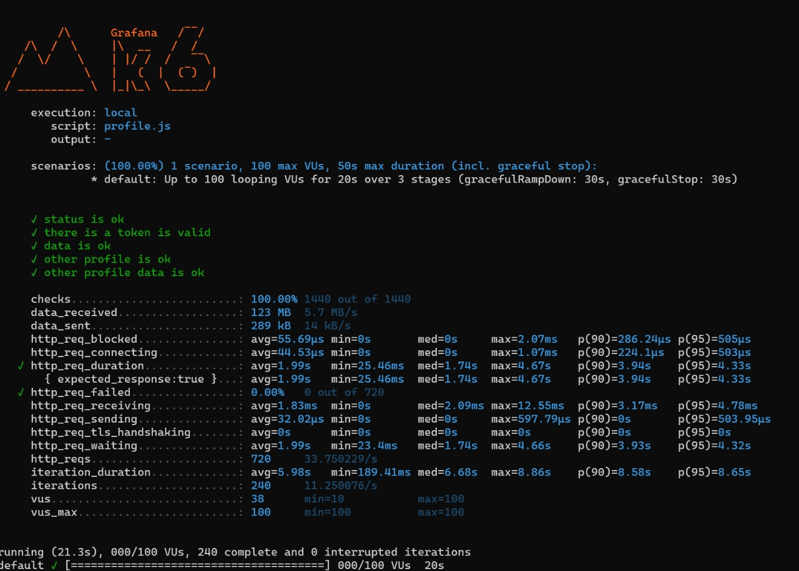
</div>


## Bonuses
- **UI/UX Mirip LinkedIn**
- **Connection Recomendation**
- **Typing Indicator**

## Pembagian Tugas

| Feature        |      Front end |         Back end |
|----------------|----------------|------------------|
| **Basics** |
| Auth and authorization| 13522124 | 13522124, 13522146 |
| Profile | 13522130 | 13522130 |
| Connections | 13522146 | 13522146 |
| Feed | 13522124 | 13522124 |
| Chat and Websockets | 13522130, 13522146| 13522130, 13522146 |
| Notifications | 13522146 | 13522146 |
| Stress and load test | | 13522146 |
|  **Bonus**  |
| UI/UX LinkedIn |  |  |
| Connection Recomendation | 13522124 | 13522124 |
| Typing Indicator | 13522146 | 13522146 |
